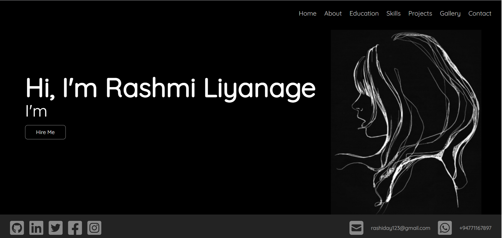

<!--
*** Thanks for checking out the Best-README-Template. If you have a suggestion
*** that would make this better, please fork the repo and create a pull request
*** or simply open an issue with the tag "enhancement".
*** Don't forget to give the project a star!
*** Thanks again! Now go create something AMAZING! :D
-->

<!-- PROJECT SHIELDS -->
<!--
*** I'm using markdown "reference style" links for readability.
*** Reference links are enclosed in brackets [ ] instead of parentheses ( ).
*** See the bottom of this document for the declaration of the reference variables
*** for contributors-url, forks-url, etc. This is an optional, concise syntax you may use.
*** https://www.markdownguide.org/basic-syntax/#reference-style-links
-->

<!-- PROJECT LOGO -->
 

  

<h1 align="center">MY PROFILE PROJECT</h1>

  

    This includes my protofolio!
     

## About The Project

 <b>Hi,I'm Rashmi Liyanage.This is a protofolio web site project.</b>

### Site Map

[https://www.gloomaps.com/PxlMMnwdMA](https://www.gloomaps.com/PxlMMnwdMA)

### Wire Frame

[https://wireframe.cc/7DuiWq](https://wireframe.cc/7DuiWq)

### Mockup

[https://www.figma.com/file/KofXPyGEiT06dPMsZVX2JN/Untitled?node-id=0%3A1](https://www.figma.com/file/KofXPyGEiT06dPMsZVX2JN/Untitled?node-id=0%3A1)

### Web Site

[https://rashiprofile.000webhostapp.com/](https://rashiprofile.000webhostapp.com/)

## For More Information, Please Check Out or Contact Me Via

   &nbsp;&nbsp;

   &nbsp;&nbsp;

   &nbsp;&nbsp;

   &nbsp;&nbsp;

   &nbsp;&nbsp;

 

  :heart_eyes: Thanks for watching my profile! Have a nice day! :wink:  
  &copy; 2021 Rashi Liyanage rashidya

